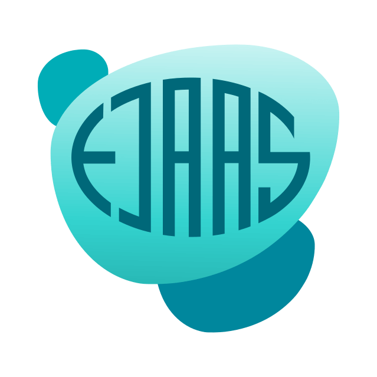
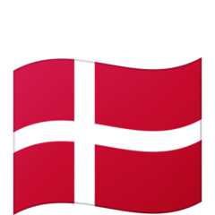

# Hello - I'm [Lars Ejaas](https://github.com/LarsEjaas) 

<!-- PROJECT LOGO -->
 

  

I am a passionated frontend developer from Denmark   
I enjoy working with modern agile development methods and Jamstack technologies.  
¯¯¯¯¯¯¯¯¯¯¯¯¯¯¯¯¯¯¯¯¯¯¯¯¯¯¯¯¯¯¯¯¯¯¯¯¯¯¯¯
 
 My main focus is on web development with tools like React and TypeScript.  
 But, I am definitely not afraid of learning new things and I always try to push my limits and expand my skillset.
 
Check out my personal webpage to learn more about me and what I do.
 

  · <a href="https://larsejaas.com/skills/">Read about my skills</a>
 · 
 
· <a href="https://larsejaas.com/">Visit my personal webpage </a> ·

 
 

 &nbsp;&nbsp;&nbsp;&nbsp;
   
 
   
 

 <i>Feel free to contact me directly at Twitter, LinkedIn,  
 or from the contact form on my webpage!</i>
  
  
       

 

